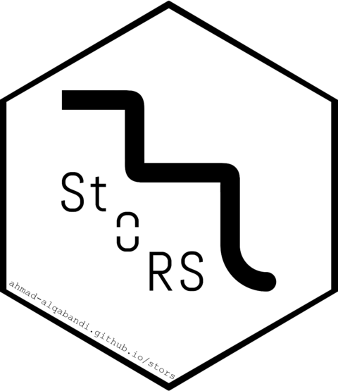

# 📦 `{stors}` R package 

**StORS** (Step Optimised Rejection Sampling) is an optimised rejection sampling method designed for efficient sampling from univariate probability density functions.
It constructs a proposal distribution using computationally efficient steps that adapt around the target density.

Built-in distributions can have any type of unbounded tails, as **Inverse Transform** sampling is used when necessary.
However, for user-provided distributions, if unbounded, the tails must be log-concave since **Adaptive Rejection Sampling (ARS)** is applied in this case.

## Installation

You can install **StORS** directly from R-universe:

``` r
install.packages('stors', repos = c('https://ahmad-alqabandi.r-universe.dev', 'https://cloud.r-project.org'))
```

Or from GitHub:

``` r
# install.packages("pak")
pak::pak("ahmad-alqabandi/stors")
```

## Example

### Sampling from a Built-in Normal Distribution

The first example demonstrates sampling from a **built-in Normal distribution** using a **pre-optimised proposal** that is constructed at package installation time for efficiency.

``` r
library("stors")

# Generate 1000 samples from the standard normal distribution
x <- srnorm(1000)

# Visualize the density
hist(x)
```

### Re-optimizing the Built-in Normal Proposal

If needed, the user can re-optimize the proposal for the normal distribution.
This can be useful for tasks such as sampling from a truncated normal distribution.

``` r
# Re-optimize the proposal for a truncated normal distribution (e.g., between -2 and 2)
srnorm_optimize(xl = -2, xr = 2)

# Generate new samples using the optimised proposal
x <- srnorm(1000)

# Visualize the truncated normal density
hist(x)
```

### Building a Proposal for a Custom Distribution

Users can build a custom proposal by passing a probability density function (PDF) to `build_proposal()`.
The following example demonstrates building a proposal for a Pareto distribution.

``` r
# Define the Pareto PDF
dpareto <- function(x, alpha) {
  alpha / x^(alpha + 1)
}

# Build a proposal distribution for Pareto
g <- build_proposal(f = dpareto,
                    modes = 1,
                    lower = 1,
                    upper = Inf,
                    steps = 256,
                    alpha = 2)

# Print and plot the proposal
print(g)
plot(g)

# Create a sampler from the proposal
rpareto_sampler <- build_sampler(g)

# Generate 1000 samples from the Pareto distribution
x <- rpareto_sampler(1000)

# Visualize the sampled distribution
hist(x)
```

For more details, please see the [Getting Started vignette](https://ahmad-alqabandi.github.io/stors/articles/stors_package.html)
